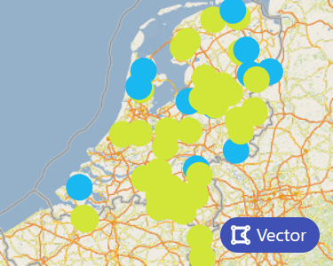

### Ellipsis Preview

This package allows you to easily load a preview for your Ellipsis Drive layers.




### Using the package

Place preview.js in your project directory. Construct an EllipsisPreview object, passing an object as paramater containing the following properties:

1. "div", an HTML element where the folder browser should be displayed in.
2. "cb" (semi-optional), the callback function to be called when a layer is clicked. A default callback is provided, but please provide your own.
3. "layer" (semi-optional), a layer object for which you want to display a preview
4. "pathId" (semi-optional), instead of a layer object, you may also provide a pathId, in which case the layer object wil be retrieved by the package
5. "token" (optional), the (Ellipsis) api token to be used.
6. "osmToken" (optional), munidal open street map token (to remove the QR code displayed)
7. "styleId" (optional), the id of the style you would like to render as preview
8. "width" (optional), the width of the preview to be generated. if none is provided, the width of the provided div is used.
9. "height" (optional), the height of the preview to be generated. if none is provided, the height of the provided div is used.
10. "disableCbIfNoPreview" (optional), default false, disable the callback when no preview is shown
11. "showLayerType" (optional), default true, determines whether the type of the layer is displayed
12. "vectorPreviewFeaturesCount" (optional),  default 50, the number of features displayed for vector layers

### Example usage
Place "ellipsis-preview.js" in the same folder as test.html and main.js. You can find ellipsis-preview.js to the right at the Github page, or click [here](https://github.com/ellipsis-drive/preview-package/releases/).

test.html

```html
<html>
  <body>
    <div id="test" style="width: 300px; height: 240px;"></div>
    <script type="module" src="main.js"></script>
  </body>
</html>
```

main.js
```javascript
import "./ellipsis-preview.js"

let div = document.getElementById("test");

let callback = (layerobj) => {
    console.log("Clicked on layer");
    console.log(layerobj);
}

let options = {
    div: div,
    pathId: "2109c37a-d549-45dd-858e-7eddf1bd7c22", // vulcano
    cb: callback,
};

let preview = new EllipsisPreview(options);
```